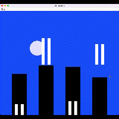

# My JAVA Animator 🚀

## Intro
This project strictly follows MVC pattern. Model handles all the calculations and prepare the data for View. 
Model doesn't directly communicate to View. Instead, Controller plays as a middle guy sending data back and forth.





## Start the animation
TODO

## Shape
  - comes in 2 types: Ellipse, Rect
  - store attribute's : x position, y position, width, height, rgb, these info is used in View to render on canvas  
  - toString method output the text represantation of this shape
  - toSVGString method output SVG Tags `<rect>` or `<ellipse>`  along with it's attributes


## Motion
  - comes in 3 types: ChangeColor, Move, Resize
  - store attribute's : startTime, endTime, and specific data related to each class.
  - store "Shape" reference (which this motion applys to) inside this class. With this, I can directly do calucations and easily set the delta values on the target Shape.
  - toString method output the text represantation of this motion
  - toSVGString method output SVG Tags ``` <animate>``` along with it's attributes

## Model 
 - use HashMap to store different Shapes read from input source
 - use ArrayList to store Motions ead from input source
 - addShape and addMotion
 - implement whatever View needs

## Controller
 - start method calling View display() function to start the animation
 - delegate whatever View needs to Model

## View
 - comes in two Views: ViewGUI, ViewText (svg file and system.out)
 - void display(int speed), display the output in given speed.
 - void addController(IController c), store the reference to Controller, letting View to have access to Controller, so that it can get data from Model


